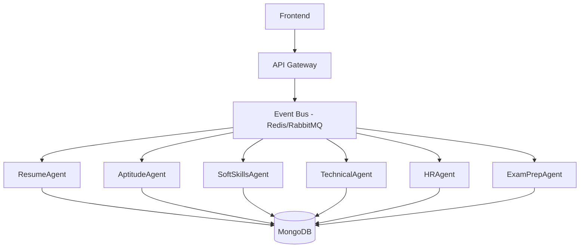

# StudyMate AI - Agentic Framework Architecture

## 🚀 Overview

StudyMate AI uses a **microservices-based agentic framework** powered by **FastAPI**, **MongoDB**, and **Redis/RabbitMQ** for inter-agent communication. This architecture enables intelligent, autonomous agents that collaborate to provide personalized learning experiences.

## 🏗️ Architecture Components

### Core Technologies
- **Backend**: FastAPI (Python)
- **Database**: MongoDB
- **Event Bus**: Redis Streams / RabbitMQ
- **Frontend**: React + TypeScript
- **ML/AI**: Python (scikit-learn, TensorFlow, OpenCV, Mediapipe)

### Agent Communication Flow


## 🤖 Agent Specifications

### 1. ResumeAgent
**Purpose**: Extracts and analyzes user profiles from resumes

**Features**:
- NLP-powered resume parsing
- Skill gap analysis
- Dynamic profile scoring
- Experience validation

**MongoDB Collections**:
```javascript
// users collection
{
  _id: ObjectId,
  email: String,
  profile: {
    name: String,
    contact: Object,
    summary: String,
    experience: Array,
    education: Array,
    skills: Array,
    certifications: Array
  },
  profile_score: Number,
  skill_gaps: Array,
  created_at: Date,
  updated_at: Date
}
```

**Events Published**:
- `resume.parsed`
- `profile.scored`
- `skills.analyzed`

### 2. Interview Agent Suite

#### AptitudeAgent
**Purpose**: Logic and reasoning assessment

**Features**:
- Quantitative reasoning
- Pattern recognition
- Critical thinking evaluation
- Adaptive difficulty

**Events**: `aptitude.completed`, `aptitude.scored`

#### TechnicalAgent  
**Purpose**: Programming and technical knowledge

**Features**:
- Coding challenges
- System design questions
- Technology-specific assessments
- Best practices evaluation

**Events**: `technical.completed`, `technical.scored`

#### SoftSkillsAgent (ML-Powered)
**Purpose**: AI-driven behavioral analysis

**Features**:
- **Facial Analysis**: Eye contact, confidence, nervousness detection
- **Speech Analysis**: Clarity, pace, filler words
- **Emotional Intelligence**: Communication skills, leadership potential
- **Real-time Processing**: Live video analysis during interviews

**ML Components**:
```python
# Facial Analysis Pipeline
1. MediaPipe Face Mesh → Face landmarks detection
2. Eye Contact Tracking → Pupil direction analysis  
3. Emotion Classification → DeepFace/FER models
4. Temporal Analysis → LSTM for pattern smoothing
5. Confidence Scoring → Multi-factor analysis
```

**Events**: `softskills.analyzed`, `emotions.detected`, `behavior.scored`

#### HRAgent
**Purpose**: General interview and culture fit

**Features**:
- Behavioral questions
- Company culture alignment
- Career goal assessment
- Background verification

**Events**: `hr.completed`, `hr.scored`

### 3. ExamPrepAgent
**Purpose**: Personalized learning recommendations

**Features**:
- Progress tracking
- Gap-based recommendations
- Study plan generation
- Performance analytics

**Events**: `prep.recommended`, `progress.updated`

## 📊 MongoDB Database Schema

### Core Collections

#### 1. Users Collection
```javascript
{
  _id: ObjectId,
  email: String,
  profile: {
    name: String,
    phone: String,
    github: String,
    linkedin: String,
    summary: String,
    experience: [{
      title: String,
      company: String,
      duration: String,
      description: String
    }],
    education: [{
      degree: String,
      institution: String,
      duration: String,
      grade: String
    }],
    skills: {
      programming: [String],
      frameworks: [String],
      tools: [String],
      databases: [String]
    },
    certifications: [String]
  },
  profile_score: Number,
  skill_gaps: [String],
  created_at: Date,
  updated_at: Date
}
```

#### 2. Interview Sessions Collection
```javascript
{
  _id: ObjectId,
  user_id: ObjectId,
  interview_type: String, // 'aptitude', 'technical', 'soft-skills', 'hr'
  status: String, // 'in-progress', 'completed', 'abandoned'
  questions: [{
    question_id: String,
    question_text: String,
    expected_duration: Number,
    difficulty: String
  }],
  responses: [{
    question_id: String,
    response_text: String,
    response_video_url: String,
    duration: Number,
    analysis: {
      facial_metrics: Object,
      speech_metrics: Object,
      content_score: Number,
      confidence_level: Number
    }
  }],
  overall_score: Number,
  recommendations: [String],
  created_at: Date,
  completed_at: Date
}
```

#### 3. ML Analysis Results Collection
```javascript
{
  _id: ObjectId,
  session_id: ObjectId,
  question_id: String,
  analysis_type: String, // 'facial', 'speech', 'content'
  metrics: {
    eye_contact_percentage: Number,
    confidence_score: Number,
    nervousness_indicators: [String],
    speech_clarity: Number,
    filler_word_count: Number,
    pace_analysis: Object,
    emotion_timeline: [{
      timestamp: Number,
      emotion: String,
      confidence: Number
    }]
  },
  processed_at: Date
}
```

## 🔄 Event-Driven Communication

### Event Bus Implementation (Redis Streams)

```python
# Event Bus Service
import redis
import json
from typing import Dict, Any

class EventBus:
    def __init__(self):
        self.redis_client = redis.Redis(
            host='localhost', 
            port=6379, 
            decode_responses=True
        )
    
    async def publish_event(self, stream: str, data: Dict[str, Any]):
        """Publish event to Redis stream"""
        await self.redis_client.xadd(stream, data)
    
    async def subscribe_to_events(self, streams: list, consumer_group: str):
        """Subscribe to multiple event streams"""
        # Implementation for event consumption
        pass

# Example Events
EVENTS = {
    'resume.parsed': {
        'user_id': 'ObjectId',
        'profile_data': 'Object',
        'timestamp': 'ISO String'
    },
    'interview.softskills.completed': {
        'session_id': 'ObjectId',
        'user_id': 'ObjectId', 
        'scores': 'Object',
        'recommendations': 'Array'
    },
    'ml.analysis.ready': {
        'session_id': 'ObjectId',
        'analysis_type': 'String',
        'results': 'Object'
    }
}
```

## 🎯 Soft Skills ML Implementation

### Real-Time Facial Analysis Pipeline

```python
# SoftSkillsAgent - ML Processing
import cv2
import mediapipe as mp
import numpy as np
from deepface import DeepFace
import tensorflow as tf

class SoftSkillsAnalyzer:
    def __init__(self):
        self.face_mesh = mp.solutions.face_mesh.FaceMesh(
            static_image_mode=False,
            max_num_faces=1,
            refine_landmarks=True,
            min_detection_confidence=0.7
        )
        
    async def analyze_video_stream(self, video_stream):
        """Real-time analysis of interview video"""
        metrics = {
            'eye_contact': [],
            'emotions': [],
            'confidence_indicators': [],
            'engagement_level': []
        }
        
        for frame in video_stream:
            # Face detection and landmark extraction
            face_landmarks = self.extract_face_landmarks(frame)
            
            # Eye contact analysis
            eye_contact_score = self.analyze_eye_contact(face_landmarks)
            metrics['eye_contact'].append(eye_contact_score)
            
            # Emotion detection
            emotion = self.detect_emotion(frame)
            metrics['emotions'].append(emotion)
            
            # Confidence analysis
            confidence = self.analyze_confidence(face_landmarks, emotion)
            metrics['confidence_indicators'].append(confidence)
        
        return self.generate_feedback(metrics)
    
    def analyze_eye_contact(self, landmarks):
        """Analyze eye gaze direction for camera eye contact"""
        # Implementation for eye contact tracking
        pass
    
    def detect_emotion(self, frame):
        """Emotion classification using DeepFace"""
        try:
            analysis = DeepFace.analyze(
                frame, 
                actions=['emotion'], 
                enforce_detection=False
            )
            return analysis[0]['emotion']
        except:
            return {'neutral': 100}
    
    def generate_feedback(self, metrics):
        """Generate actionable feedback from analysis"""
        return {
            'eye_contact_percentage': np.mean(metrics['eye_contact']),
            'dominant_emotion': self.get_dominant_emotion(metrics['emotions']),
            'confidence_level': np.mean(metrics['confidence_indicators']),
            'recommendations': self.generate_recommendations(metrics)
        }
```

### On-Device vs Cloud Processing

**Recommended Hybrid Approach**:

1. **On-Device** (Browser):
   - Face detection and basic landmark extraction
   - Real-time eye contact tracking
   - Basic emotion classification
   
2. **Backend Processing**:
   - Advanced ML model inference
   - Temporal analysis and pattern recognition
   - Comprehensive feedback generation
   - Data storage and historical analysis

## 🚀 Development Setup

### Prerequisites
- Docker & Docker Compose
- Python 3.9+
- Node.js 18+
- MongoDB 6.0+
- Redis 7.0+

### Environment Variables
```bash
# Backend (.env)
MONGODB_URL=mongodb://localhost:27017
DATABASE_NAME=studymate_ai
REDIS_URL=redis://localhost:6379
OPENAI_API_KEY=your_openai_key
JWT_SECRET=your_jwt_secret

# Frontend (.env)
VITE_API_BASE_URL=http://localhost:8000
VITE_WEBSOCKET_URL=ws://localhost:8001
```

### Quick Start
```bash
# Start infrastructure
docker-compose up -d mongodb redis

# Start backend services
cd backend
python -m uvicorn api-gateway.main:app --reload --port 8000

# Start individual agents
python -m uvicorn agents.soft-skills.main:app --reload --port 8001
python -m uvicorn agents.resume-parser.main:app --reload --port 8002

# Start frontend
npm install && npm run dev
```

## 📈 Monitoring & Analytics

### Agent Health Monitoring
- Redis-based health checks
- Performance metrics collection
- Error tracking and alerting
- Response time monitoring

### ML Model Performance
- Prediction accuracy tracking
- Model drift detection
- A/B testing for different algorithms
- User feedback integration

## 🔮 Future Enhancements

1. **Advanced ML Models**:
   - Custom emotion recognition models
   - Voice sentiment analysis
   - Personality assessment algorithms

2. **Enhanced Communication**:
   - WebRTC for real-time video processing
   - Distributed agent orchestration
   - Cross-agent learning and adaptation

3. **Scalability**:
   - Kubernetes deployment
   - Auto-scaling based on demand
   - Multi-region support

## 📝 API Endpoints

### Core Routes
```
POST /api/interviews/start          # Start interview session
GET  /api/interviews/{id}          # Get interview details  
POST /api/interviews/{id}/analyze  # Submit for ML analysis
GET  /api/users/{id}/profile       # Get user profile
POST /api/users/resume/upload      # Upload resume for parsing
GET  /api/analytics/dashboard      # Get user analytics
```

### Agent Communication
```
POST /api/events/publish           # Publish event to bus
GET  /api/events/subscribe         # Subscribe to event streams
GET  /api/agents/health           # Check agent health status
```

This architecture provides a robust, scalable foundation for AI-powered interview preparation with real-time ML analysis and intelligent agent communication.